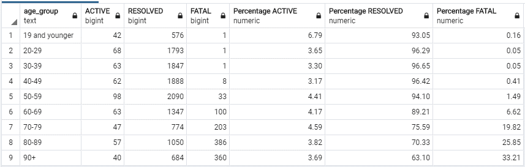
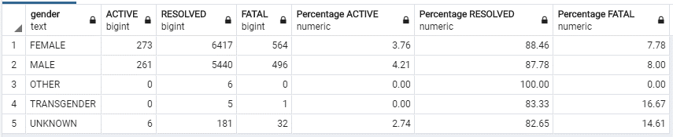
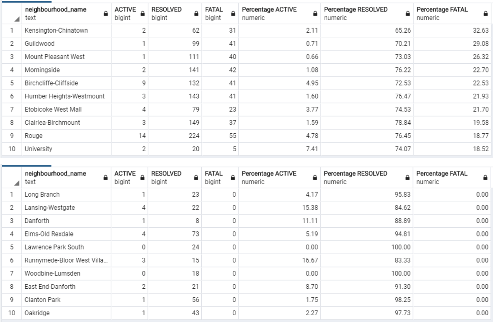

# ML Model for Toronto Cases

## Overview
Using TensorFlow Library, we are aiming to create a Neural Network Binary Classification Model that can predict the recovery (or fatality) of the patient depending on the age, the gender and the health region of Toronto, Canada.

#### Resources
- **Software:** JupyterLab, pgAdmin 4
- **Languages:** Python, PostgreSQL

## Initial Analysis
Tables below shows;
* the number of active, resolved and fatal cases and their percentage by age group
* the number of active, resolved and fatal cases and their percentage by gender
* top 10 and bottom 10 areas of Toronto by the fatality rate

We can observe that;
* Higher the age, higher risk of fatality
* Certain area has higher fatality rate than the other area

In addition, we have really small number of cases for some genders (OTHER, TRANSGENDER and UNKNOWN). UNKNOWN gender also has slightly different fatality rate compared to MALE and FEMALE. We need to be careful how we treat these data in our ML models.

Table 1:

Table 2:

Table 3:

## ML Model

## Results
TO BE UPDATED