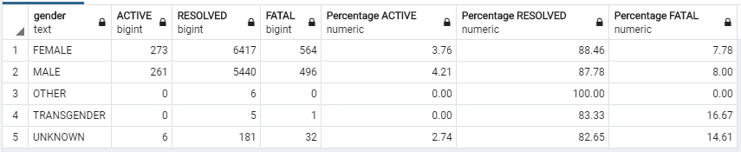
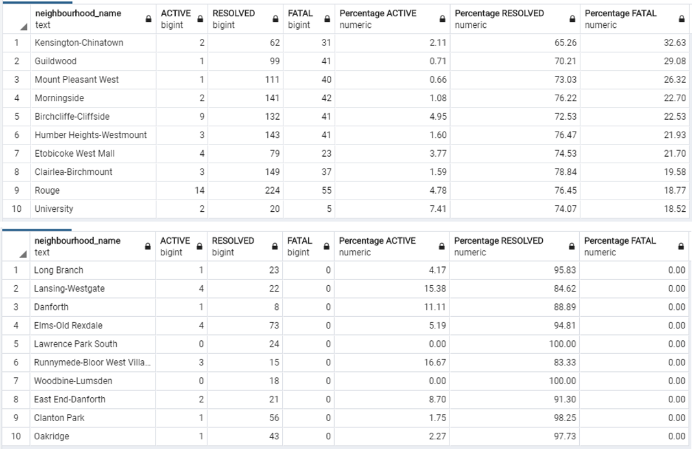
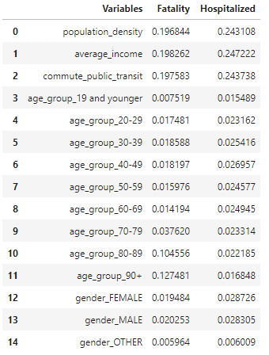

# Machine Learning Model for Toronto Cases

## Overview
Using TensorFlow and Scikit-learn, we created Binary Classification Models that can predict the chance of being hospitalized and fatality based on the age, gender and the area of living of the individuals in City of Toronto, Canada. 

Queries / Codes used during the analysis can be found;
* Initial Analysis: [SQL Queries](ML-Model_Toronto/SQL_Query)
* ML Models: [IPython Notebook](ML-Model_Toronto/Toronto_Cases_Binary_Classifier.ipynb)

## Initial Analysis
Tables below shows;
* the number of active, resolved and fatal cases and their percentage by age group
* the number of active, resolved and fatal cases and their percentage by gender
* top 10 and bottom 10 areas of Toronto by the fatality rate

We can observe that;
* Higher the age, higher risk of fatality
* Certain area has higher fatality rate than the other area

In addition, we have really small number of cases for some genders (OTHER, TRANSGENDER and UNKNOWN). UNKNOWN gender also has slightly different fatality rate compared to MALE and FEMALE. We need to be careful how we treat these data in our ML models.

Table 1:

Table 2:

Table 3:

## Model

#### Pre-processing
Following steps are taking during pre-processing of data.
* Remove ACTIVE cases as results are unknown
* All gender with small number of data available are binned as "Other" for the reason stated in the [initial analysis](#Initial-Analysis)
* Encoding categorical variable to numeric variable
* 2 datasets were created using different dependent variables.
    * outcome: RECOVERED or FATAL
    * ever_hospitalized: 1 (yes) or 0 (no)
* Split dataset into a training and testing dataset using default setting (training: 75%, testing: 25%)
* Scaling dataset as population density and average income are relatively large values compared with other

#### ML Models
We tested the Neural Network Binary Classification Models and Random Forest Classifier (RF Model).
We believe the RF Model would be a better model choice for this analysis as;
* Both models had similar accuracy of around 90%
* Random Forest Classifier has better explainability and can show which dependent variable had more impact to the outcome.

#### Findings and Limitations
* Gender, Male or Female, do not affect the fatality risk of COVID-19.
* Age, especially being older than 70, has significantly increases the chance of fatality. It is interesting to see that importance of age is low for model that predict if individual will be hospitalized is low. However, this could be the result of encoding, which creates multiple columns.
* Demographic and Income of the individual also have significant impact to the outcome of COVID-19. However, at the time of the analysis, only aggregated data is available for demograpic information. Hence, it is very difficult to determine which type of demographic information had higher importance than other.

