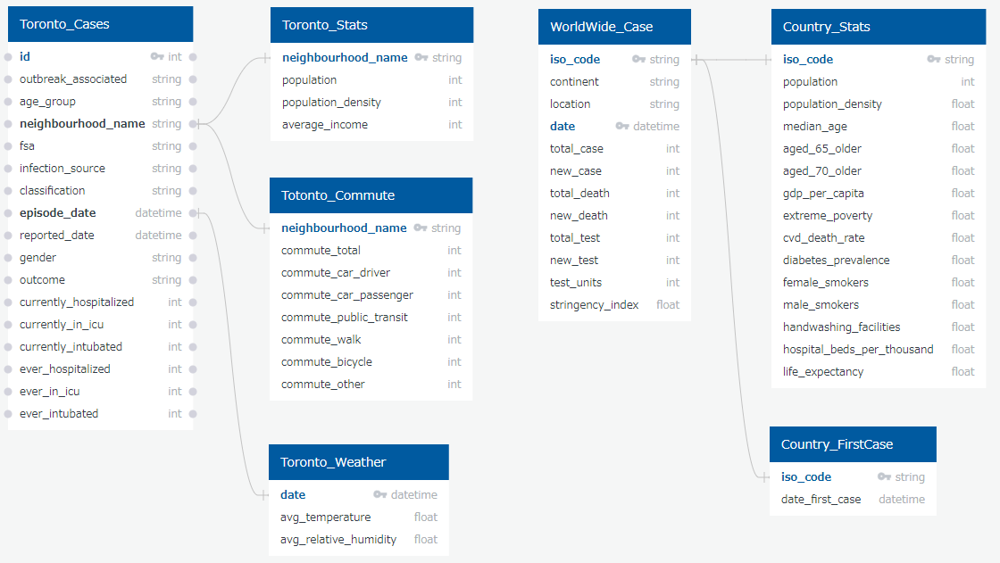

# Team-3 COVID-19 Analysis - Database

## Data Extraction, Clean-up, Transform and Load to PostgreSQL
We used two main datasets provided by 1) City of Toronto and 2) Our World in Data. 1) has the details of the individual Covid-19 cases in Toronto and 2) contains the daily new cases and deathes by country world-wide.

Supplement datasets that provides the demographics of the region or country such as population density, average income, weather data and etc were also identified and loaded to PostgreSQL DB. IPython Notebook files used are stored and accessable via following links.

* [Toronto Covid-19 Data ](Update_TorontoData.ipynb)
* [World Wide Covid-19 Data](Update_WorldWideData.ipynb)
* [Toronto Supplement Stats](Update_TorontoStats.ipynb)
* [Toronto Weather Data](Update_TrontoWeather.ipynb)

#### 1. Extraction of Data
Following methods were used to extract the datasets from each web site;
* City of Toronto: CKAN API was used to directly extract datasets from HP
* Our World in Data: Data was provided through GitHub direct link to csv file
* Gov. of Canada: Weather data for the past 1000 days were downloaded via csv file

#### 2. Clean-up and Transforming Data
Python Pandas library was used to;
* Drop irrelevant data
* Convert strings to appropriate data type such as datetime, int and float
* Transpose Wide data into Long Data
* Rename column names to SQL suitable names

#### 3. Loading Data to PostgreSQL
Python SQLAlchemy was used to store datasets to PostgreSQL DB through Amazon Web Service.

## PostgreSQL DB
The relationship between each tables are described in the database relationship diagram below. PostgreSQL query and SQLAlchemy were used to feed data into ML models.
The details of pre-processing processes and ML models are explained in README.md stored under ML-Models folder.

## Data Source

**Toronto Dataset**
1. City of Toronto, COVID-19 Cases in Toronto, https://open.toronto.ca/dataset/covid-19-cases-in-toronto/, Accessed July 19, 2020.
1. City of Toronto, Neighbourhood Profiles, https://open.toronto.ca/dataset/neighbourhood-profiles/, Accessed July 19, 2020.
1. Government of Canada, Weather Data Download for Toronto, https://toronto.weatherstats.ca/, Accessed July 19, 2020.

**World-Wide Dataset**
1. Our World in Data, Statistics and Research Coronavirus Pandemic (COVID-19), https://ourworldindata.org/coronavirus, Accessed July 19, 2020.

## References
1. Government of Canada, Coronavirus disease (COVID-19): Outbreak update, https://www.canada.ca/en/public-health/services/diseases/2019-novel-coronavirus-infection.html.
1. Centers for Disease Control and Prevention, Provisional COVID-19 Death Counts by Sex, Age, and State, https://data.cdc.gov/NCHS/Provisional-COVID-19-Death-Counts-by-Sex-Age-and-S/9bhg-hcku.
1. Centers for Disease Control and Prevention, Deaths involving coronavirus disease 2019 (COVID-19) by race and Hispanic origin group and age, by state, https://data.cdc.gov/NCHS/Deaths-involving-coronavirus-disease-2019-COVID-19/ks3g-spdg
1. USA Facts, Coronavirus Locations: COVID-19 Map by County and State, https://usafacts.org/visualizations/coronavirus-covid-19-spread-map
1. Government of Ontario, Confirmed positive cases of COVID-19 in Ontario, https://data.ontario.ca/dataset/confirmed-positive-cases-of-covid-19-in-ontario